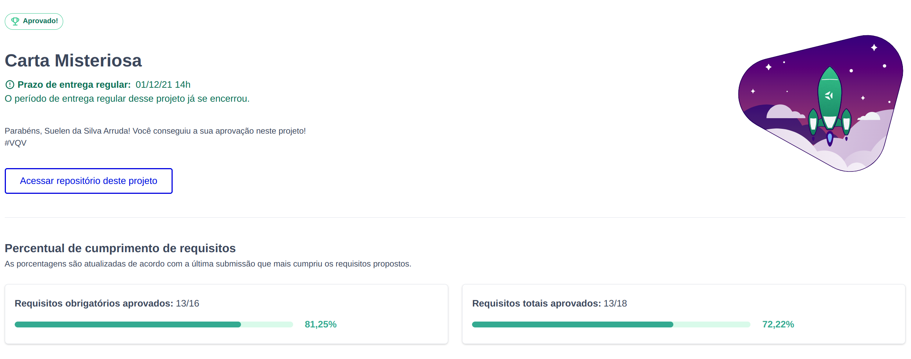

# Week Challenge 2-5

## Mistery Letter Project

 Um jogo desenvolvido a partir da manipulação do DOM. Seria simples se fosse apenas este projeto naquela semana. Mas foram 5 projetos!! Uma semana intensa de atividades e riqueza de conteúdo. Uma das coisas que mais aprendi foi a gerir meu tempo diante de tantos afazeres 

---

#### Você pode conferir os outros projetos aqui:

<ul>
<li><a href="https://github.com/onyrius/challenge1">challenge 1: Guess Color Project</a></li>
<li><a href="https://github.com/onyrius/challenge3">challenge 3: Pixel Art Project</a></li>
<li><a href="https://github.com/onyrius/challenge4">challenge 4: Guess Color Project</a></li>
<li><a href="https://github.com/onyrius/challenge5">challenge 5: Meme Generator Project</a></li>
 
</ul>

---

## Habilidades

- Manipular o DOM.

- Manipular o Javascript.

- Manipular o CSS.

---

## O que deverá ser desenvolvido

- Será desenvolvida uma aplicação utilizando JavaScript, HTML5 e CSS3.

---

## Desenvolvimento

- Você irá desenvolver um site que gere cartas misteriosas.

---

## Stack utilizada

  
  
 

## 🔗 Links

## Status do projeto

